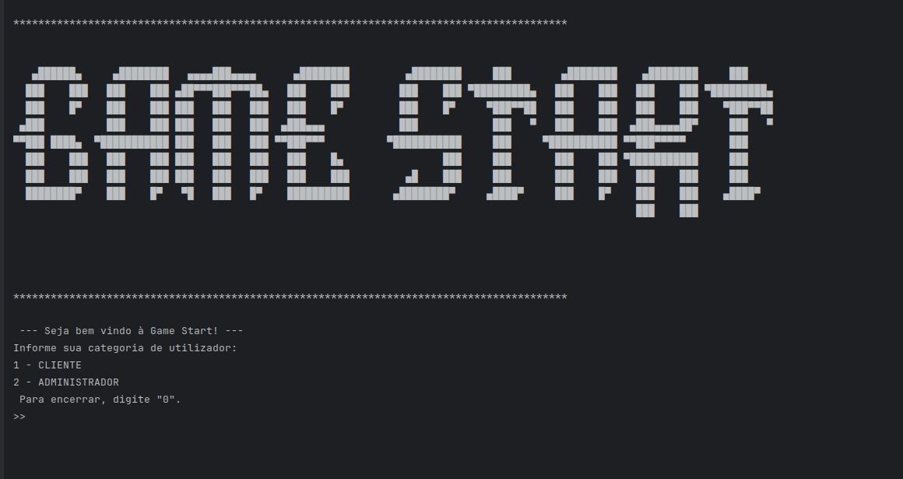

# GameStart Management System



## Overview

The GameStart Management System is a Java application designed to help the GameStart video game store manage their business operations. The system provides features for analyzing sales, managing customer data, and handling administrative tasks through different user roles (ADMIN and CLIENT).

## Features

### ADMIN Menu
1. **View Files**: Display the contents of Sales, Customers, and Categories files.
2. **Total Sales**: Show the total number of sales and their cumulative value.
3. **Total Profit**: Calculate and display the total profit based on commission percentages.
4. **Customer Search**: Given a customer ID, display all associated information (name, contact, email).
5. **Most Expensive Game**: Display the most expensive game sold and the customers who bought it.
6. **Top Customers**: Show the top spending customers and a list of all games they purchased.
7. **Top Category**: Display the category that generated the most profit and the profit amount.
8. **Sales Search**: Given a game name, display all customers who purchased it.
9. **Top 5 Games**: Show the top 5 games that generated the most profit.
10. **Bottom 5 Games**: Show the top 5 games that generated the least profit.
11. **Register New Sale**: Add a new sale entry to the sales file.

### CLIENT Menu
1. **Register New Client**: Simulate client registration and display the success message.
2. **Search Parking**: Display available parking spots based on specific criteria.
3. **Print Catalog**: Print all game titles without duplicates.
4. **Print Graphic Catalogs**: Print the catalog of selected games with graphical content.
5. **Print Publisher Catalog**: Given a publisher, display all categories and respective games.
6. **Print Category Catalog**: Given a category, display all publishers and respective games.
7. **Print Most Recent Game**: Display the most recently sold game.
8. **Find Friends**: Given a customer ID, display names and emails of all customers who bought the same games.


## Getting Started

### Prerequisites
- JDK 17

### Installation

**Clone the repository:**
1. Clone the repository:
    ```sh
    git clone https://github.com/Pris-c/game-start-management.git
    ```


**Compile the Program:**

2. Go into the root directory of the projec:
    ```sh
    cd gamestart-management/src
    
3. Compile the project:
    ```sh
    javac Main.java
    

 **Run:**

4. Execute the _'Main'_  class to initiate user interaction.
    ```bash
    java Main
    ```


## Usage

Upon running the application, you will be prompted to choose your user type (ADMIN or CLIENT). Depending on your choice, the system will display the respective menu options.

### Example Usage (ADMIN)

1. **Initial menu**:
    ```plaintext
    >  --- Seja bem vindo à Game Start! ---
    > Informe sua categoria de utilizador:
    > 1 - CLIENTE
    > 2 - ADMINISTRADOR
    >  Para encerrar, digite 0.
    ```


1. **Login**:
    ```plaintext
    > Nome de utilizador:
    > Senha: 
    ```
2. **View Total Sales**:
    ```plaintext
    > Menu
    > 2  - Consultar Total de Vendas
    ```

### Example Usage (CLIENT)

1. **Register New Client**:
    ```plaintext
    > Tipo de Utilizador (ADMIN || CLIENTE): CLIENTE
    >
    > 1. Novo Registo
    >
    > -- Registrar Cliente --
    > Nome do cliente: Steve Jobs
    > Telefone para contacto: 911 222 333
    > Endereço de e-mail: apple@gmail.com
    >
    > Cliente registrado com sucesso!
    > Steve Jobs | 911 222 333 | apple@gmail.com
    ```

## File Structure

The application reads and writes data from/to CSV files stored in the project directory:
- `GameStart_Vendas.csv`: Stores all sales records.
- `GameStart_Clientes.csv`: Stores all customer information. This file must not have a header.
- `GameStart_Categorias.csv`: Stores commission percentages for different game categories.
- `GameStart_Admins.csv`: Stores login credentials for administrative users.


## Contribution

Contributions are welcome! Feel free to open issues to report bugs or propose enhancements. If you'd like to contribute directly, open a pull request.

## Author

Priscila Campos 👩‍💻

